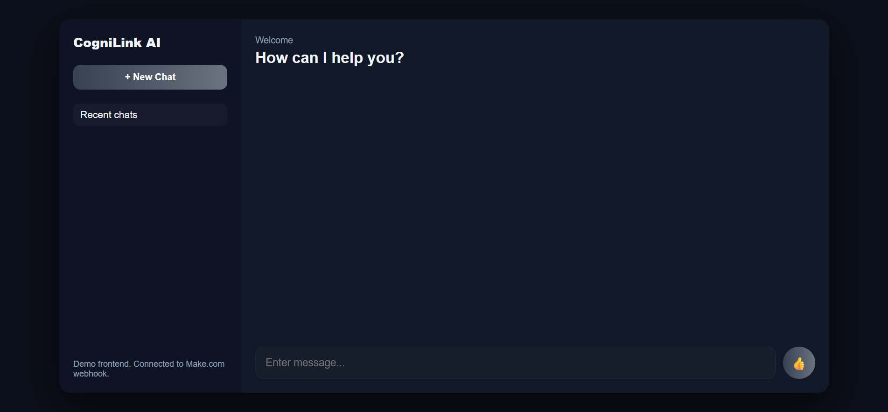
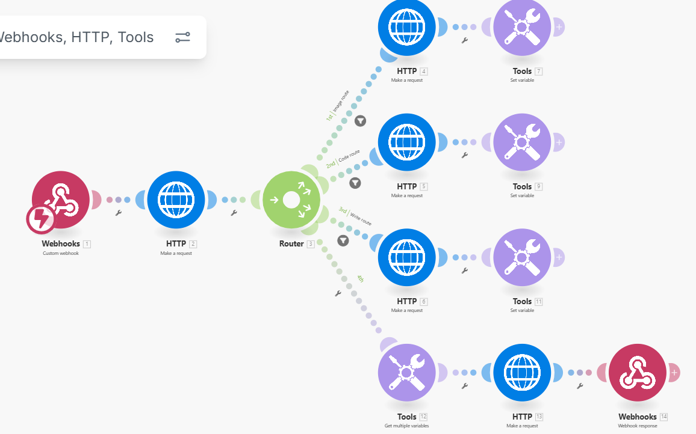
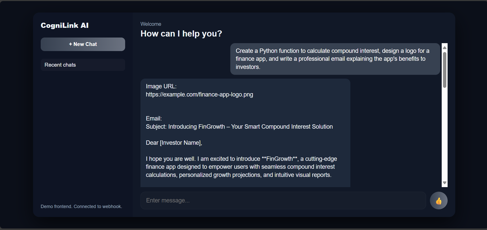

# CogniLink AI

CogniLink AI is an innovative and intelligent platform designed to simplify how complex AI-powered requests are handled by seamlessly breaking them down into manageable parts and routing each to highly specialized AI engines. Whether it's generating clean, efficient code, designing professional-grade images, or composing persuasive, business-ready texts, CogniLink AI orchestrates these diverse tasks concurrently to deliver a coordinated, comprehensive response with unmatched efficiency and precision.

---

## 🚀 Project Overview

CogniLink AI acts like a digital waiter in a multi-cuisine restaurant — it receives a complex order, splits it into smaller tickets, directs each to expert kitchens, and then assembles all dishes into a perfect final meal.

- **Why it matters:**  
  Many current AI tools operate with one model at a time, which limits quality and throughput. CogniLink AI’s intelligent routing allows multiple specialized AI engines to collaborate, unlocking better results and scalability.

- **Core features:**  
  - Smart request classifier that divides tasks (code, image, writing)  
  - Parallel processing in dedicated “kitchens” (APIs/services)  
  - Centralized variable storage for coordination and final assembly  
  - Extensible architecture to add more AI specialties or tasks  

---

## 🎥 Demo & Assets

- Watch the demo video: https://drive.google.com/file/d/16yvfJdSYWzN1cVLoIy6-CTRXvY81rKmc/view?usp=drive_link
- Browse screenshots showcasing frontend, backend flows, and architecture:
- 
- 
- 

---

## 💻 Try the Prototype

Open the sample frontend locally for a simple interactive demo:  open Prototype.html(Uploaded)

> Note: Classifier API integration is a work-in-progress; current prototype uses a placeholder.

---

## 🧩 Architecture Overview

- **Webhook** receives and stores user requests.  
- **Router** intelligently classifies and splits requests into typed tickets.  
- Three parallel kitchens(for now) generate expert outputs (code snippets, images, emails, etc.).  
- Outputs are stored and then combined into a cohesive, multi-part final response.
  
---

## 📄 License

This project is licensed under the [MIT License](LICENSE).

---

## 🙌 Contributing

Contributions, feedback, and suggestions are welcome! Please open an issue or pull request.

---

## 📬 Contact

Any questions? Reach out via GitHub Discussions or email [ayush0108.gupta@gmail.com].

---

Thank you for exploring CogniLink AI — bringing modular intelligence and elegant orchestration to complex AI requests.

